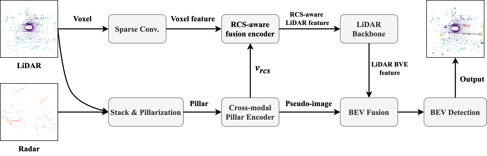

# RLRFusion: RCS-based LiDAR-Radar Fusion for 3D Object Detection

## Abstract

To capitalize on the strengths of both sensors, a novel RCS-based LiDAR-Radar fusion network, named RLRFusion, is proposed for 3D object detection in this paper. The network takes LiDAR and radar point clouds as inputs and processes them through dual bird's-eye view (BEV) feature extraction streams, followed by BEV fusion and detection module to produce the detection results. At the input-level fusion, a cross-modal pillar encoder is introduced to address the sparse radar data and its lack of height information. At the feature-level fusion, an RCS-aware fusion encoder leverages the Radar Cross Section (RCS) distribution by mapping pillar features to their surroundings, which enhances object size estimation and addresses the challenges faced by LiDAR in adverse weather conditions. Experimental results show that RLRFusion achieves competitive performance on the nuScenes dataset, with strong detection results even in rainy conditions.
<!-- add svg figure media/2pipeline.drawio.png below-->



## Results
3D object detection results on nuScenes dataset.

|     Method      | Sensor |  NDS  |  mAP  | Car  | Motor. | Bicycle | Ped. | Truck | Bus  | Trailer |
|:---------------:|:------:|:-----:|:-----:|:----:|:------:|:-------:|:----:|:-----:|:----:|:-------:|
|  PointPillars   |   L    |   -   | 47.10 | 80.7 |  26.7  |   5.3   | 70.8 | 49.4  | 62.0 |  34.9   |
|   CenterPoint   |   L    | 65.50 | 59.30 | 84.6 |  54.7  |  34.9   | 83.9 | 54.4  | 66.7 |  36.7   |
|  CenterPoint*   |   L    | 68.39 | 60.49 | 85.2 |  57.4  |  38.3   | 84.5 | 54.1  | 67.8 |  36.1   |
|     RVF-Net     |  L+R   |   -   | 54.90 |  -   |   -    |    -    |  -   |   -   |  -   |    -    |
|    RadarNet     |  L+R   | 68.28 | 60.40 | 85.9 |  57.4  |  38.4   | 84.1 | 53.9  | 66.7 |  37.2   |
|   EZFusion-LR   |  L+R   |   -   | 63.21 |  -   |   -    |    -    |  -   |   -   |  -   |    -    |
|  EZFusion-LR*   |  L+R   | 69.68 | 61.84 | 86.1 |  59.0  |  43.6   | 83.3 | 55.7  | 68.2 |  36.5   |
|   Bi-LRFuion    |  L+R   | 69.63 | 62.00 | 86.5 |  59.2  |  42.0   | 84.4 | 55.2  | 67.9 |  38.4   |
| RLRFusion(ours) |  L+R   | 69.74 | 62.17 | 86.3 |  58.8  |  45.5   | 84.5 | 55.9  | 67.6 |  36.6   |


## Usage
### Prerequisites

Please note we use **version 1.x** of MMdetection3D, which is after the coordinate system refactoring.

We list our environment setup below:
- Python 3.8
- PyTorch 1.11.0+cu113
- TorchVision 0.12.0+cu113
- CUDA 11.3
- MMCV-full 1.7.0
- MMDetection 2.28.2
- MMSegmentation 0.30.0
- MMDetection3D 1.0.0rc6

### Environment

You can set up the environment according to your own needs. Below is the process we followed to set up the environment.

You need to pull the Docker image and create a Docker container.

```docker pull ufoym/deepo:pytorch-py38-cu113.```

Then, use the following commands to change the PyTorch version and install the required environment packages.

```pip install torch==1.11.0+cu113 torchvision==0.12.0+cu113 torchaudio==0.11.0 --extra-index-url https://download.pytorch.org/whl/cu113```

```pip install mmcv-full==1.7.0 -f https://download.openmmlab.com/mmcv/dist/cu113/torch1.11/index.html```

```pip install mmdet==2.28.2```

```pip install mmdet3d==1.0.0rc6```

```pip install mmsegmentation==0.30.0```

```pip install spconv-cu113```

### Data Preparation
To prepare the dataset and ensure the data (radar) is correctly loaded, please follow the [instructions](https://github.com/open-mmlab/mmdetection3d/blob/main/docs/en/advanced_guides/datasets/nuscenes.md#dataset-preparation) given in MMDetection3D. Please use the file provided in `tools/data_converter/radar_converter_coordinate_v1.py` to generate the corresponding data instead.

Please also make sure you edit the `data_root` directory in `plugin/RLRFusion/configs/early+rcs+cat.py` to point to the correct data directory.

### Training
To train LiRaFusion with 8 GPUs, you can use the following command:

```bash tools/dist_train.sh plugin/RLRFusion/configs/early+rcs+cat.py 8```

To train LiRaFusion with single GPU, you can use the following command:

```python tools/train.py plugin/RLRFusion/configs/early+rcs+cat.py```

### Evaluation
To evaluate the trained model with single GPU, you can use the following command:

```python tools/test.py plugin/RLRFusion/configs/early+rcs+cat.py work_dirs/early+rcs+cat/latest.pth```

### Acknowledge

Our project is partially supported by the following codebase. We would like to thank for their contributions.

* [Bi-LRFusion](https://github.com/JessieW0806/Bi-LRFusion)
* [RCBEVDet](https://github.com/VDIGPKU/RCBEVDet)
* [Futr3D](https://github.com/Tsinghua-MARS-Lab/futr3d)
* [mmdetection3d](https://github.com/open-mmlab/mmdetection3d)

## Citation

If RLRFusion is useful or relevant to your research, please kindly recognize our contributions by citing our paper:

```
@inproceedings{wu2024RLRFusion,
  author    = {Wu Yiqi, He Jiale, Cai Xiantao, Li Changliang, Chen Yilin and Zhang Dejun},
  title     = {RLRFusion: RCS-based LiDAR-Radar Fusion for 3D Object Detection},
  journal   = {},
  year      = {2024},
}
```